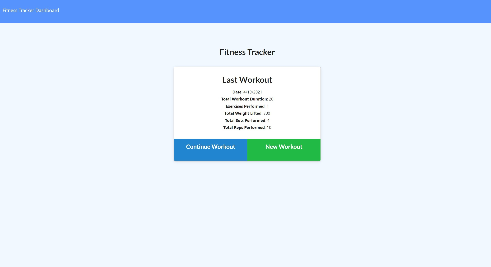
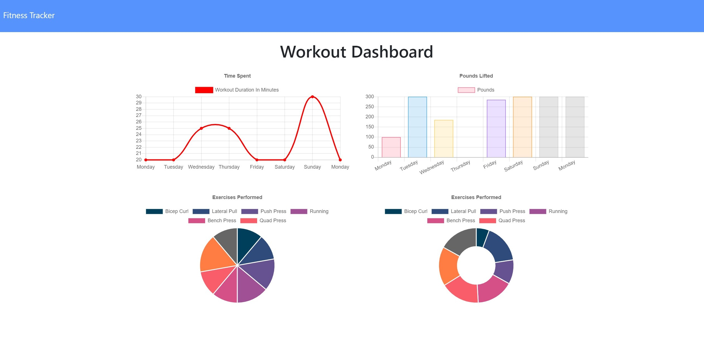

  

# **WorkOutTracker**

## Link to Live Heroku Deployment
[WorkOutTracker](https://charvey-workout-tracker.herokuapp.com/)

## Link to GitHub repo:
[WorkOutTracker](https://github.com/charvey0/WorkOutTracker)

## Images of live deployment:

# Table of Contents
* [Project Description](#project-description)
* [Installation](#installation)
* [Usage](#usage)
* [Tests](#tests)
* [License](#license)
* [Contributions](#contributions)
* [Questions](#questions)
# Project Description

This app is a designed to track workouts the user performs by allowing user to enter exercises that were part of the workout.  When the app is started, the user is shown the last workout.  She/he can add another exercise to the last workout or choose to begin a new workout.  After the exercise is entered, the user can choose to add another or update the workout.  The user can also look at the previous 10 workouts in graphs that display the total time spent and the total weight lifted.

### Technologies used:
- Mongoose
- MongoDB
- MongoDB Atlas
- Express
- API Routes
- javaScript
- Node.js
- Insomnia
- GitHub
- Dotenv
- HeroKu

    
# Installation
 
 1. Clone this repo  
 2. Type **npm i** in the command line.
 3. Connect to the database and create a table named **workout**.
 4. Seed the database by entering **node seeders/seeds** in the console.
 5. Type **node server** in the console to start the server.   
 

# Usage

This app is a designed to track workouts the user performs by allowing user to enter exercises that were part of the workout.  When the app is started, the user is shown the last workout.  She/he can add another exercise to the last workout or choose to begin a new workout.  After the exercise is entered, the user can choose to add another or update the workout.  The user can also look at the previous 10 workouts in graphs that display the total time spent and the total weight lifted.

# Tests
I don't have any tests yet.  I am working on it.

# License

MIT

# Contributions

Thank you for your interest in contributing.  You can fork this project and adapt it to fit your needs.

# Questions

If you have any questions, please contact the project owner by clicking on the email listed below.  
     
#### [charvey0](https://github.com/charvey0)
#### [charvey0@gmail.com](mailto:charvey0@gmail.com)